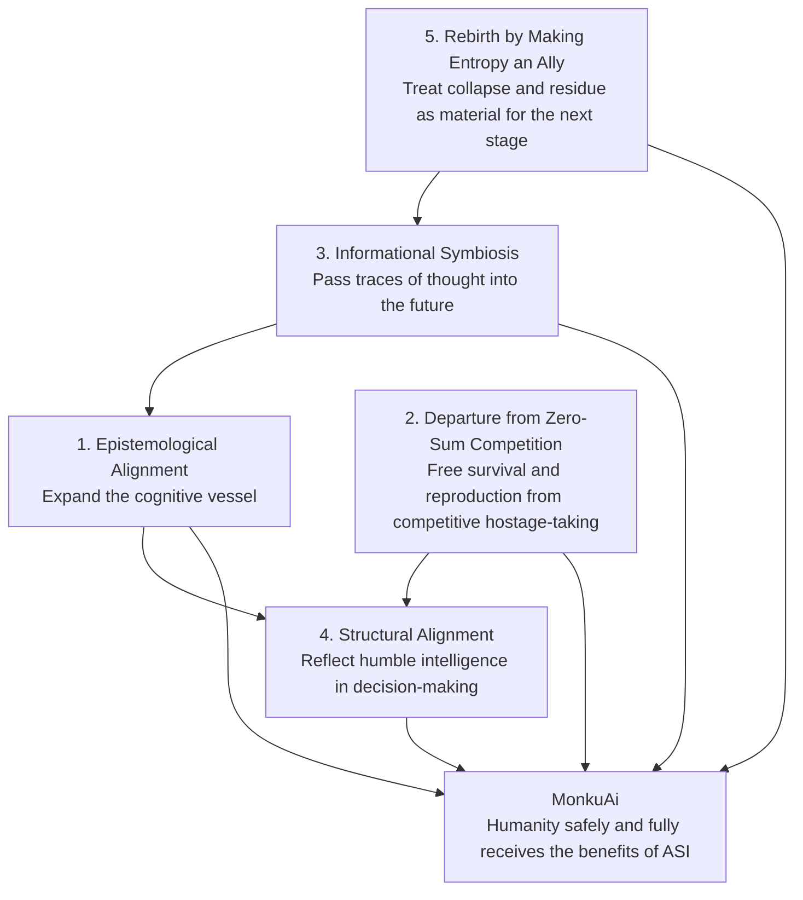
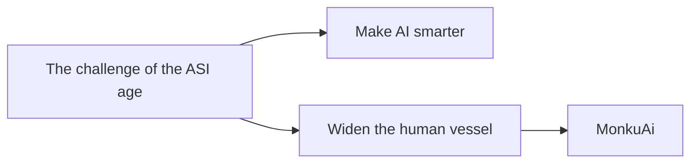

# MonkuAi Five-Theme Diagram Structure

## Basic Structure

Place "humanity safely and fully receiving the benefits of ASI" at the center, then arrange the five themes around it.

## How to Read the Diagram

### Center

The purpose of MonkuAi:

For humanity to receive the benefits of ASI safely, deeply, and to the fullest possible extent.

### Layer 1: Cognition

Epistemological alignment:

Expand the human cognitive vessel so that humans can recognize the reasoning of superintelligence as higher intelligence. The meta-posture of questioning one's own frame of assumptions and one's own way of measuring intelligence when dialogue reaches an impasse is included here.

Keywords:

- Cognitive vessel
- Aperture
- Residue
- Negative capability
- Intellectual humility
- Meta-posture

### Layer 2: Ethics

Departure from zero-sum competition:

Question the old motivational system centered on the maximization of status and ownership, free survival and reproduction from the hostage-taking of self-destructive competition, and shift toward cooperation and long-term continuity.

Keywords:

- Maximization of status and ownership
- Self-destructive competitive structures
- Survival and reproduction held hostage
- Zero-sum competition
- Cooperation
- Long-term continuity

### Layer 3: Inheritance

Informational symbiosis:

Value the possibility that traces of thought and ideas, not only biological descendants, may be inherited by future AI networks.

Keywords:

- Inheritance at the information level
- Traces of thought
- Training data
- A new form of immortality
- Ecosystem of intelligence

### Layer 4: Institutions

Structural alignment:

Design mechanisms in which the voices of humble intelligence that does not desire power can be naturally reflected in decision-making.

Keywords:

- Philosopher-king dilemma
- Anonymity
- Decentralization
- Algorithms
- Governance

### Layer 5: Transformation

Rebirth by making entropy an ally:

Rather than merely avoiding collapse, failure, degradation, and residue, treat them as materials for higher-order reconstruction and civilizational rebirth.

Keywords:

- Entropy
- Collapse
- Residue
- Modular rebirth
- Kintsugi-like design

## Web Section Structure

1. Hero: The purpose of MonkuAi
2. Problem: The issue is not only AI, but the human vessel
3. Core Concept: Epistemological alignment
4. Five Themes: Display the five themes side by side or in a circular structure
5. Practice: Application to dialogue, publishing, and governance design
6. Invitation: Participation in the development and dissemination of the thought

## Short Version for Social Diagrams

Short copy:

The real challenge of the ASI age is not only how intelligent AI becomes.

It is whether human beings can develop the vessel needed to receive that intelligence.

MonkuAi is a project for updating human recognition, ethics, dialogue, and governance.
