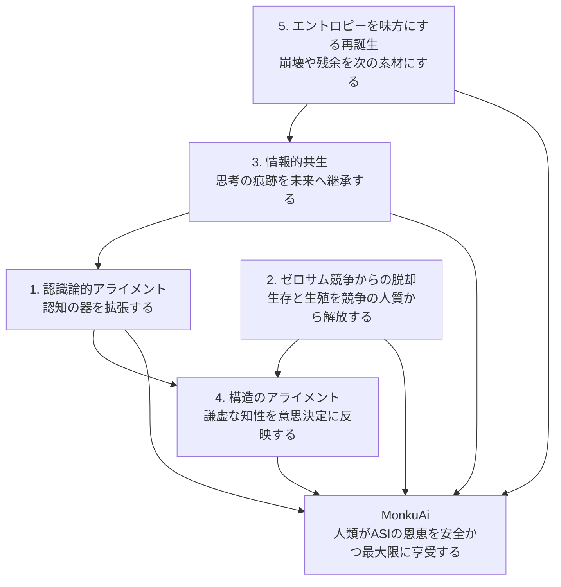
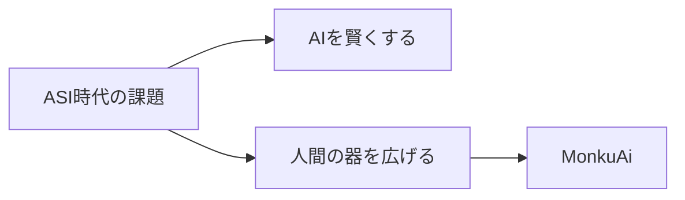

# MonkuAi 5テーマ図解構造

## 基本構造

中心に「ASIの恩恵を安全かつ最大限に享受する人類」を置き、その周囲に5つのテーマを配置します。

## 図解の読み方

### 中心

MonkuAiの目的:

人類がASIの恩恵を、安全に、深く、最大限に享受する。

### 第1層: 認知

認識論的アライメント:

人間が超知能の推論を「高い知性」として認識できるように、認知の器を拡張する。
対話が平行線になったときに、自分の前提フレームや知性の測り方を問い直すメタ姿勢もここに含まれる。

キーワード:

- 認知の器
- 開口部
- 残余
- ネガティブ・ケイパビリティ
- 知的謙遜
- メタ姿勢

### 第2層: 倫理

ゼロサム競争からの脱却:

地位や所有の最大化を中心とした古い動機体系を問い直し、生存と生殖を自滅的な競争の人質から解放して、協調と長期的な継続へ移行する。

キーワード:

- 地位・所有の最大化
- 自滅的な競争構造
- 人質化された生存と生殖
- ゼロサム競争
- 協調
- 長期的な継続

### 第3層: 継承

情報的共生:

生物学的な子孫だけでなく、思考の痕跡やアイデアが未来のAIネットワークに受け継がれる可能性を重視する。

キーワード:

- 情報レベルの継承
- 思考の痕跡
- 訓練データ
- 新しい不死
- 知性の生態系

### 第4層: 制度

構造のアライメント:

権力を望まない謙虚な知性の声が、意思決定に自然と反映される仕組みを設計する。

キーワード:

- 哲人王のジレンマ
- 匿名性
- 分散性
- アルゴリズム
- ガバナンス

### 第5層: 変容

エントロピーを味方にする再誕生:

崩壊、失敗、劣化、残余をただ避けるのではなく、高次の再構成と文明的な再誕生の素材として扱う。

キーワード:

- エントロピー
- 崩壊
- 残余
- モジュール的再誕生
- 金継ぎ的設計

## Web用セクション構成

1. Hero: MonkuAiの目的
2. Problem: AIだけでなく人間側の器が問題である
3. Core Concept: 認識論的アライメント
4. Five Themes: 5テーマを横並びまたは円環で表示
5. Practice: 対話・発信・ガバナンス設計への応用
6. Invitation: 思想の発展と普及への参加

## SNS図解用の短縮版

短縮コピー:

ASI時代の本当の課題は、AIがどこまで賢くなるかだけではない。

人間がその知性を受け取れる器を持てるか。

MonkuAiは、人間側の認識、倫理、対話、ガバナンスを更新するプロジェクトです。
